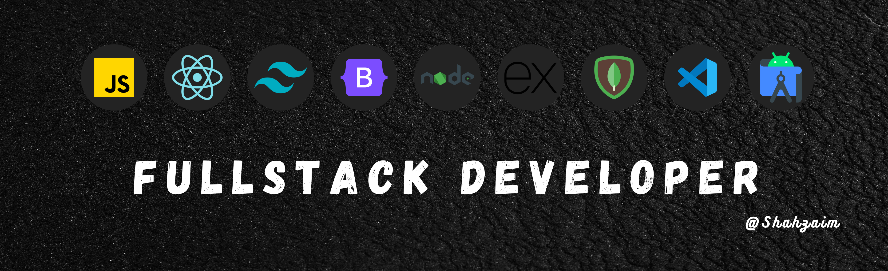

# 💻 About Me

I'm a passionate **Full-Stack Web Developer** who loves building web apps using the **MERN stack** (MongoDB, Express, React, Node). I'm also learning **React Native** to build hybrid mobile apps.

### 🚀 Technologies & Tools

  
  
  
  
  
  
  

### 🌐 Web Development

  
  
  
  
  
  
  
  
  
  
  
  

### 📱 Mobile App Development

  
  

---

### 🧠 Featured Projects

#### 🚧 Project 1 - Task Manager App

> A full-featured productivity web app to manage your daily tasks and deadlines with user auth, MongoDB, and full CRUD.
> Live Demo: [taskmanager.live](https://taskmanager.live) | Repo: [GitHub](https://github.com/yourusername/task-manager-app)

#### 🛒 Project 2 - E-Commerce Website

> A full-stack shopping site with cart, checkout, payment integration, and admin panel.
> Live Demo: [shopnow.live](https://shopnow.live) | Repo: [GitHub](https://github.com/yourusername/e-commerce-site)

#### 🎨 Project 3 - Animated Portfolio Website

> A visually stunning developer portfolio using GSAP & Framer Motion.
> Live Demo: [portfolio.dev](https://portfolio.dev) | Repo: [GitHub](https://github.com/yourusername/animated-portfolio)

---

### 📈 GitHub Stats

  
  

---

### 📫 Let's Connect

  
  

---

### ✨ Quote

> "Code is not just code, it’s your imagination turned into reality."

---

*Thanks for visiting my profile! Drop a ⭐️ if you like my work.*
